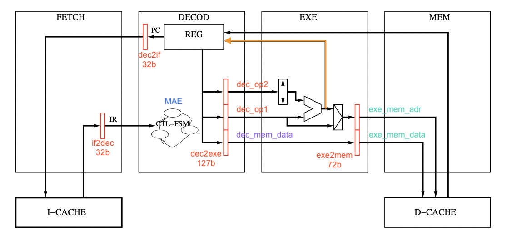
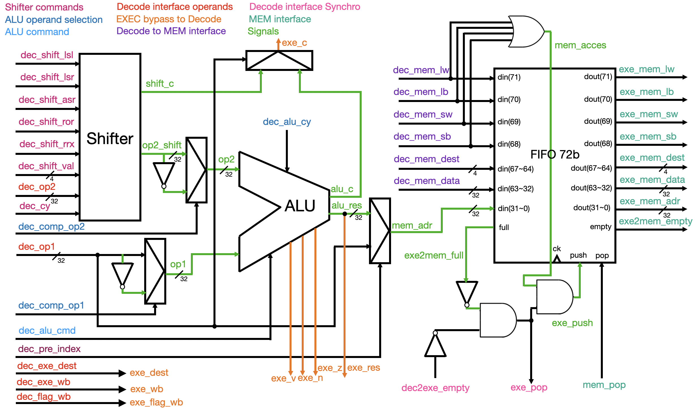
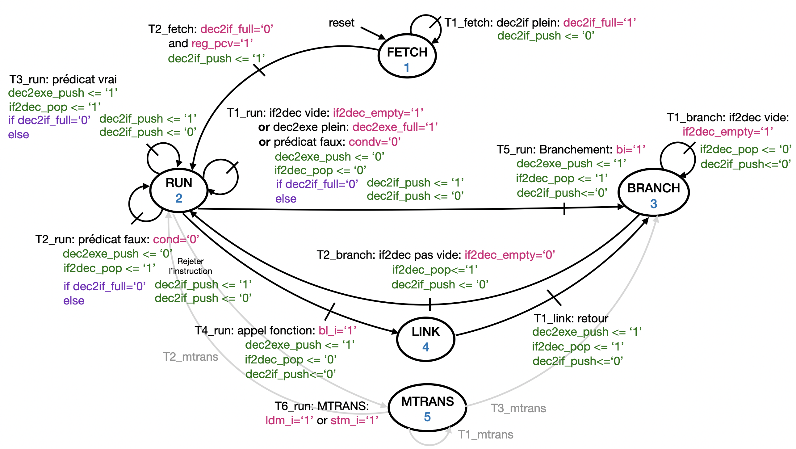
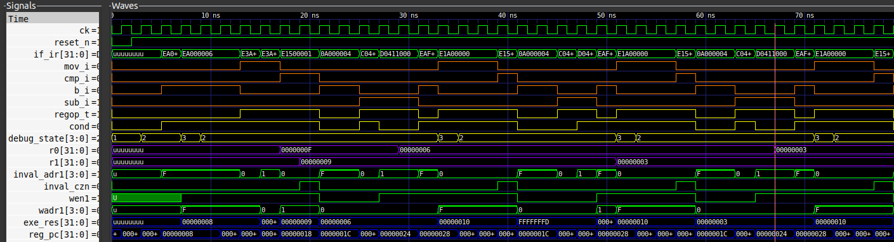

# ARM Single Core 4 Pipeline CPU RTL Design

This project is the RTL design of an ARM single core 4 pipeline CPU. It is implemented in VHDL and can be simulated using GHDL.



## Prerequisites

Ensure that you have GHDL installed on your system. You may need to adjust the GHDL path in the Makefile located in the TB folder to match your system configuration.

## Diagram of EXEC



## Register Bank (REG)

- Comprising 16 registers of 32 bits, each associated with a validity bit.
- The four flags (C, Z, N, V) each have a unique validity bit.
- Upon reset, all registers are considered valid.
- When a register is identified by DECOD as the destination of an instruction, it is invalidated.
- When a result produced by EXEC or MEM is written into the register, it is validated.
- In case of conflict, writing from MEM must be ignored due to its inherently older nature.
- Provides three read ports, two write ports, two invalidation ports, four flags with their respective validity bits, as well as the PC register, its validity bit, and its increment command.

## State Machine of DECOD
- **FETCH**: Startup state or after a reset.
  - *T1*: **dec2if** is full, no new address is sent (`dec2if_push` $\Leftarrow$ $'0'$).
  - *T2*: **dec2if** is not full, PC is valid, sending a new address (`dec2if_push` $\Leftarrow$ $'1'$). Transition to the RUN state.

- **RUN**: General operating state for all decoded instructions.
  - *T1*: **if2dec** is empty, **dec2exe** is full, the predicate is not valid, or the operand is not valid. No retrieval of the next instruction (`if2dec_pop` $\Leftarrow '0'$). The instruction is not launched (`dec2exe_push` $\Leftarrow'0'$). If **dec2if** is not full, sending a new address.
  - *T2*: The predicate is false; the instruction is rejected. The next instruction is retrieved. If **dec2if** is not full, sending a new address.
  - *T3*: The predicate is true; the instruction is launched. The next instruction is retrieved. If **dec2if** is not full, sending a new address.
  - *T4*: The instruction is a function call, the instruction is launched. No retrieval of the next instruction and no sending of a new address. Transition to the LINK state.
  - *T5*: The instruction is a branch, the instruction is launched, and the next instruction is also retrieved. No sending of a new address. Transition to the BRANCH state.
  - *T6*: The instruction is a multiple transfer, transitioning to the MTRANS state.

- **LINK**: Computes PC+4
  - *T1*: The transition is systematically carried out with the EXEC command to calculate a new PC value.

- **BRANCH**: Purge of the instruction following a taken branch.
  - *T1*: **if2dec** is empty. No retrieval of the next instruction. No sending of a new address.
  - *T2*: **if2dec** is not empty. The next instruction is retrieved. No sending of a new address. Transition to the RUN state.

- **MTRANS**: Processing transfer instructions:
  - *T1*: Not all specified registers have been processed.
  - *T2*: All specified registers have been processed.




## Simulation and Testing

To simulate and test the processor, follow these steps:

1. Navigate to the TB folder and run the make command:

```bash
cd TB
make
```

2. Navigate back to the main folder and run the make command:

```bash
cd ..
make
```

to execute a program written in ARM assembly, for example PGCD:

<pre>
MOV r0, #15
MOV r1, #9

while:
    CMP r0, r1
    BEQ _good 
    SUBGT r0, r0, r1
    SUBLE r1, r1, r0
    B while
</pre>

3. Run the following command to generate the graphs:

```bash
./main_tb ../test_pgcd --vcd=test.vcd
```

The execution results should look like this:


4. Use the following command to visualize the graphs:

```bash
gtkwave test.vcd
```


Please note that the gtkwave tool is required to visualize the vcd files. If it's not installed, you can install it using your package manager.
